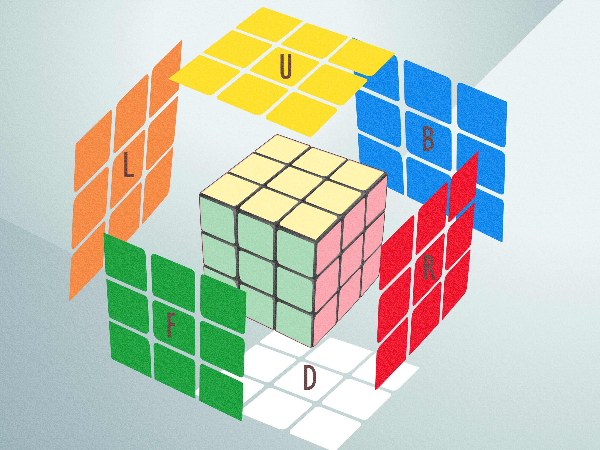

# RubiCKube

## Repository Overview
A simple python project encapsulating a Rubik's Cube library for representing, manipulating, visualizing and solving *(coming-soon)* 3x3 and 4x4 Cube puzzles.

## Rubik's Cube Overview
The Rubik's Cube is originally a three-dimensional combination puzzle invented in 1974 by Hungarian sculptor and professor of architecture Ernő Rubik. It consists of a cube-shaped frame with 26 smaller cubes, known as cubies. Each face of the cube is divided into a 3x3 grid, totaling six faces, each covered by nine stickers in one of six solid colors. When the cube is twisted, the colors get scrambled.

The primary challenge of the puzzle is to manipulate the cube by rotating its faces so that each of the six faces returns to having a single, uniform color, returning the cube to its original state. The complexity of the puzzle arises from the vast number of possible positions, which grow exponentially with larger variants of the puzzle such as the 4x4 or 5x5 etc...

The Rubik's Cube is not only considered a popular toy but is actually an object of mathematical and computational interest. It has applications in the study of algorithms and group theory, with the solution methods often involving a combination of algorithms, heuristics and intuitive problem-solving approaches.

